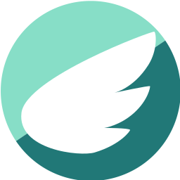

# pegasocks 

是一个基于 socks5 协议的代理客户端，意图在于支持多种类型的代理服务。
C 语言编写，轻量，支持类 unix 系统(Linux/WSL/BSDs/OSX)。

⚠️ 这是一个正在开发中的项目，请自行考虑使用成本和风险。

中文 | [English](./README_en.md)

## 特点

与其他大多数支持多协议的客户端不同，pegasocks 不依赖各种第三方 core(比如 v2ray-core 等)，而是真的去实现相关协议的拆装，并且尽可能的照顾性能。因此它

1. 🍃 足够轻量，没有 QT 或是 boost 或是其他第三方二进制的依赖。
2. 🚀 性能优先，默认多个 worker 线程，因此理论上吞吐量会比较高（待benchmark）
3. 🚥 这是一个 learn by doing 项目，欢迎大家 review 代码，提供优化思路和 C 语言编程相关的指导。
4. ❌ 没有 GUI，可以直接配合 systemd, launchd, rc 或是各种自定义脚本配置开机启动。后期计划开发一个简单的 tray indicator，在系统的托盘里显示，并且提供一些简单的交互，总之重型的 GUI 是不在考虑范围内的。

## 依赖

- openssl 1.1.1 / mbedtls 2.27.0
- libevent2

## 安装

如果你使用 Arch Linux，可以使用 aur 进行安装

> yay -S pegasocks-git --overwrite /usr/local/bin/pegas,/usr/local/share/pegasocks/*

或者直接编译如下

## 编译

> mkdir build && cd build
>
> cmake -DCMAKE_BUILD_TYPE=Release .. && make

注: OSX 系统下默认检测 `/usr/local/Cellar/openssl@1.1/` 目录下最新的 openssl 作为 openssl 根目录。另外支持手动设置 cmake 参数设置自定义版本的依赖

> -DOpenSSLx_ROOT=/xxxxxx/xxx/xxx 指定 openssl root
> 
> -DLibevent2_ROOT=xxxxxx  指定 libevent root

如果你想使用 mbedtls (在移动端的体积比 openssl 小很多) 添加下列参数

> -DUSE_MBEDTLS=ON

## 运行

> pegas -c config.json -t 4

- `-c` 指定配置文件，默认会依次尝试 `$XDG_CONFIG_HOME/.pegasrc` 或者 `$XDG_CONFIG_HOME/pegas/config` 
- `-t` 指定工作线程数量，默认为 4

## 配置

见[配置文档](https://github.com/chux0519/pegasocks/wiki/%E9%85%8D%E7%BD%AE%E8%AF%B4%E6%98%8E)

## 交互

程序启动后，默认监听 `/tmp/pegas.sock`(可以配置，同时支持 TCP 端口和 unix socket)，通过 unix socket 可以和主程序进行交互。支持的命令有：

- `GET SERVERS`，将返回服务器的信息
- `SET SERVER $idx`，设置当前服务器

在 linux 下 socat 演示

另外，支持系统托盘，见下

## 系统托盘

默认编译二进制文件不带 GUI，带上参数 `-DWITH_APPLET=ON` 开启系统托盘功能。

> cmake -DCMAKE_BUILD_TYPE=Release -DWITH_APPLET=ON .. && make

### Linux 

从命令行启动时，将 `logo/icon.svg` 放到 pegas 同级目录，然后正常使用即可。

### OSX

从命令行运行时，将 `logo/icon.png` 放到 pegas 同级目录，然后正常使用即可。

OSX上，默认会将二进制打包成 app bundle，直接将打包出的 `build/PegasApp.app` 复制到应用程序即可。

⚠️注:如果遇到无法启动的状况，请确认

1. 系统安装了 libevent (brew install libevent)
2. 是否有 **配置文件**，app bundle 会检测 `~/.config/.pegasrc`
