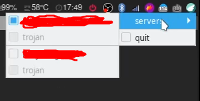

# pegasocks

是一个基于 socks5 协议的代理客户端，意图在于支持多种类型的代理服务。
C 语言编写，轻量，支持类 unix 系统。

⚠️ 这是一个正在开发中的项目，请自行考虑使用成本和风险。

## 特点

与其他大多数支持多协议的客户端不同，pegasocks 不依赖各种第三方 core(比如 v2ray-core 等)，而是真的去实现相关协议的拆装，并且尽可能的照顾性能。因此它

1. 🍃 足够轻量，没有 QT 或是 boost 或是其他第三方二进制的依赖，因此资源占用低。
2. 🚀 性能优先，默认多个 worker 线程，每个线程一个 event loop，因此理论上吞吐量会比较高（待benchmark）
3. 🚥 这是一个 learn by doing 项目，欢迎大家 review 代码，提供优化思路和 C 语言编程相关的指导。
4. ❌ 没有 GUI，可以直接配合 systemd, launchd, rc 或是各种自定义脚本配置开机启动。后期计划开发一个简单的 tray indicator，在系统的托盘里显示，并且提供一些简单的交互，总之重型的 GUI 是不在考虑范围内的。

## 依赖

- openssl 1.1.1
- libevent2
- json-c

## 编译

> mkdir build && cd build
>
> cmake .. && make

## 运行

> pegas -c config.json -t 4

- `-c` 指定配置文件，默认为同目录下 config.json
- `-t` 指定工作线程数量，默认为 4

## 系统托盘

默认编译二进制文件不带 GUI，带上参数 `-DWITH_TRAY=1` 开启系统托盘功能。

> cmake -DWITH_TRAY=1 .. && make

运行时，将 `icon.svg` 放到 pegas 同级目录，然后正常使用即可。

PS: 目前只在 linux 平台做了适配，其他平台可能暂时编译不过。

 目前只支持切换服务器，之后计划支持显示各个服务器的网络状况（get google 204 或者 ping 的时间），除此之外不再准备添加更多功能了。

## 配置

见[配置文档](https://github.com/chux0519/pegasocks/wiki/%E9%85%8D%E7%BD%AE%E8%AF%B4%E6%98%8E)

## 开发计划

- 多种协议支持
  - [x] trojan
    - [x] trojan-gfw
    - [x] trojan-go
  - [x] v2ray
    - [x] vmess
    - [x] tcp
    - [x] websocket
    - [x] tls + websocket
- 平台适配
  - [x] linux
  - [x] osx
  - [ ] FreeBSD（待测试，应该可以直接支持）
  - [ ] windows（待测试，可能需要 pthread 的支持)
